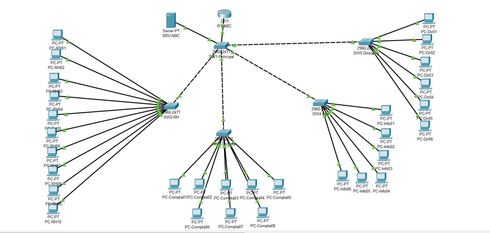

# Network Segmentation in a Small Company – Cisco Packet Tracer

Academic Cisco Packet Tracer case study for logically segmenting a fictional 30-employee company network by department.

## Available artifact

`network-segmentation.pkt` is the submitted Packet Tracer topology. The accompanying case brief identifies four departments: Human Resources (10 workstations), Accounting (8), IT (6), and Management (6). Its stated objectives are broadcast reduction, logical isolation, inter-VLAN access control, and preparation for future services.

## Requirements and use

Install Cisco Packet Tracer, open `network-segmentation.pkt`, inspect the device configurations, and use Simulation mode plus `ping`/traceroute tests to validate connectivity and isolation.

## Authors

- Adam El Akkaoui
- Mohammed Zaidouh

## Academic artefacts

- [French academic case study (PDF)](docs/academic-case-study-fr.pdf)
- [Editable French academic case study (DOCX)](docs/academic-case-study-fr.docx)

The nearby `TP_VLAN.pdf` is course material, not an authored report. No presentation or video was found.

## Testing and limitations

The Packet Tracer signature, tracked file and original topology screenshot were checked. Cisco Packet Tracer was unavailable, so VLAN IDs, credentials, addressing, trunks, routing, reachability and isolation were not independently executed. The proprietary binary contains no separately reviewable text configuration; reproducible validation requires Packet Tracer and manual inspection. No passwords or configuration exports are included.
